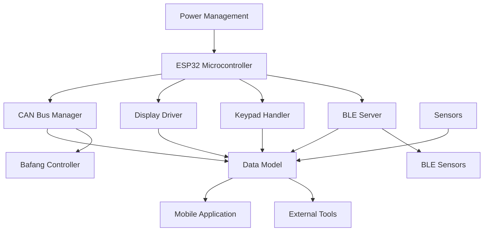

# System Architecture

## High-Level Overview

OpenRideDash follows a layered architecture designed for modularity, maintainability, and extensibility. The system is built around the ESP32 platform with CAN bus communication at its core.

### Core Principles

1. **Hardware Abstraction** - All hardware-specific code is encapsulated behind interfaces
2. **Task-Based Execution** - Each subsystem runs as an independent FreeRTOS task
3. **Event-Driven Design** - Non-blocking operations with deferred processing
4. **Progressive Enhancement** - Features are added in well-defined phases

## Architectural Layers

### 1. Hardware Layer
```
┌─────────────────────────────────┐
│       Physical Components       │
│  ESP32, CAN transceiver,        │
│  Display, Keypad, Sensors       │
└─────────────────────────────────┘
```

### 2. Hardware Abstraction Layer (HAL)
```
┌─────────────────────────────────┐
│      Abstract Interfaces        │
│  Display, Keypad, CanDriver,    │
│  TempSensor, etc.               │
└─────────────────────────────────┘
```

### 3. Subsystem Layer
```
┌─────────────────────────────────┐
│      Independent Tasks          │
│  CAN Manager, Display Driver,   │
│  BLE Server, Keypad Handler     │
└─────────────────────────────────┘
```

### 4. Application Layer
```
┌─────────────────────────────────┐
│      Core Application Logic     │
│  Data Model, State Management,  │
│  Configuration, User Interface  │
└─────────────────────────────────┘
```

### 5. Connectivity Layer
```
┌─────────────────────────────────┐
│      External Interfaces        │
│  BLE API, Mobile App, OTA,      │
│  External Tools Integration     │
└─────────────────────────────────┘
```

## Component Relationships



## Data Flow

### Telemetry Flow
```
Bafang Controller → CAN Bus → CAN Manager → Data Model → Display/Mobile App
```

### User Input Flow
```
Keypad → Keypad Handler → Data Model → CAN Manager → Bafang Controller
```

### Configuration Flow
```
Mobile App → BLE Server → Data Model → Persistent Storage
```

## Key Architectural Decisions

### 1. Task-Based Model
- **Why**: Deterministic timing, clear separation of concerns
- **Implementation**: FreeRTOS tasks with independent priorities
- **Benefit**: Easy migration to ESP-IDF if needed

### 2. Hardware Abstraction
- **Why**: Portability across different hardware configurations
- **Implementation**: Abstract base classes with concrete implementations
- **Benefit**: Testing with mock hardware, component swapping

### 3. Event-Driven Design
- **Why**: Responsive system, efficient resource usage
- **Implementation**: Interrupts set flags, main loop processes events
- **Benefit**: No blocking operations, predictable timing

### 4. Phased Implementation
- **Why**: Manageable complexity, incremental validation
- **Implementation**: Four distinct phases with clear boundaries
- **Benefit**: Reduced risk, continuous progress visibility

## Subsystem Responsibilities

### CAN Manager
- CAN bus initialization and configuration
- Message transmission and reception
- Protocol-specific message parsing
- Error handling and recovery

### Display Driver
- Display hardware initialization
- Screen buffer management
- UI rendering and updates
- Power management (backlight control)

### Keypad Handler
- Keypad scanning and debouncing
- Press/release detection
- Long-press vs short-press differentiation
- Event queuing for processing

### BLE Server
- BLE service advertisement
- Connection management
- API command processing
- Data streaming to connected devices

### Data Model
- Central state management
- Sensor data aggregation
- Configuration persistence
- State change notifications

## Communication Patterns

### Intra-System Communication
- **Shared Data Structures**: Atomic access to common state
- **Message Queues**: Inter-task communication for events
- **Callback Registration**: Event subscription model

### External Communication
- **CAN Bus**: Controller communication (500kbps typical)
- **BLE**: Mobile app and sensor connectivity
- **Serial**: Debug and development interface

## Error Handling Strategy

### Levels of Error Handling
1. **Hardware Errors**: Retry with exponential backoff
2. **Communication Errors**: Reinitialization procedures
3. **Protocol Errors**: Graceful degradation or safe mode
4. **System Errors**: Watchdog recovery or restart

### Error Reporting
- **Local**: Display error codes or messages
- **Remote**: BLE error events to mobile app
- **Logging**: Serial debug output with timestamps

## Performance Considerations

### Real-Time Requirements
- **CAN Communication**: < 10ms latency for critical messages
- **User Input**: < 100ms response time
- **Display Updates**: 30-60 FPS for smooth animations
- **BLE Notifications**: Configurable update rates (1-10Hz)

### Resource Constraints
- **Memory**: ESP32 typically has 520KB SRAM
- **Flash**: Firmware must fit within available flash (4MB typical)
- **Power**: Battery operation requires efficient power management
- **Processing**: Single-core ESP32-C3 requires efficient task scheduling

## Scalability and Extensibility

### Adding New Features
1. Implement new hardware interface (if needed)
2. Create new subsystem task
3. Extend data model for new state
4. Add BLE API commands (if external access needed)

### Supporting New Hardware
1. Create concrete implementation of abstract interface
2. Add compile-time configuration flag
3. Update factory functions
4. Test with hardware abstraction layer

## Security Considerations

### Physical Security
- Epoxy potting for weather and tamper resistance
- Secure mounting to prevent theft or damage

### Communication Security
- BLE pairing with secure connections
- Optional passkey management via mobile app
- CAN bus assumed within trusted physical domain

### System Security
- OTA updates disabled by default
- Configuration changes require authentication
- Critical parameters protected from accidental changes

## Next Steps

- **Detailed Design**: See [Hardware Architecture](hardware-architecture.md) and [Firmware Architecture](firmware-architecture.md)
- **Implementation**: Start with [Phase 1: Core System](../phases/phase1-core.md)
- **Development**: Set up your [Development Environment](../development/setup.md)

---

*This architecture provides the foundation for a reliable, extensible e-bike display system while maintaining the simplicity needed for DIY implementation.*